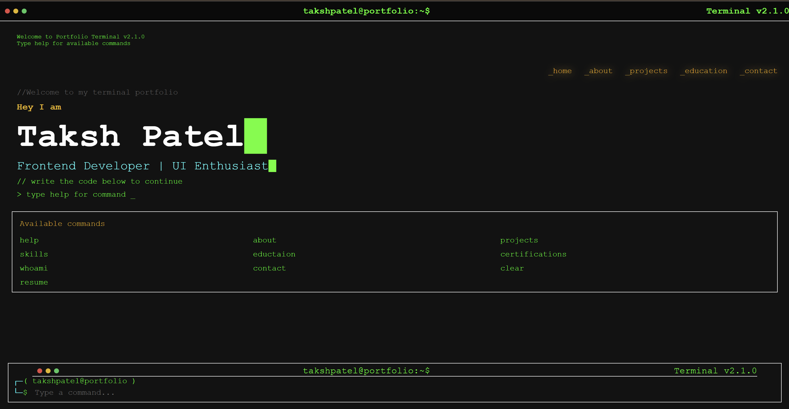

# 🖥️ Terminal-Style Developer Portfolio

A responsive, retro-themed developer portfolio built with HTML, CSS, and JavaScript.  
Features a command-line interface with interactive commands, smooth animations, and a project showcase.



## 🚀 Live Demo
[Visit Portfolio](https://takshpatel-portfolio.vercel.app/)

## ✨ Features
- **Terminal UI** – Type commands like `help`, `about`, `skills`, `projects` to navigate.
- **Responsive Design** – Works across desktop and mobile devices.
- **Smooth Animations** – Powered by Typed.js and CSS transitions.
- **Project Showcase** – Displays live projects with GitHub links.
- **Direct Resume Download** – Access via `resume` command.

## 📂 Folder Structure

```
public/
│── index.html
│── style.css
│── script.js
│── img/
│ ├── p1.png
│ ├── p2.png
│ ├── p3.png
│ └── p4.png

```


## 🛠️ Tech Stack
- **HTML5**
- **CSS3**
- **JavaScript (ES6+)**
- **Typed.js** for typing animations

## 📬 Contact
- **GitHub:** [TakshPatel02](https://github.com/TakshPatel02)
- **LinkedIn:** [Taksh Patel](www.linkedin.com/in/taksh-patel20)

---
